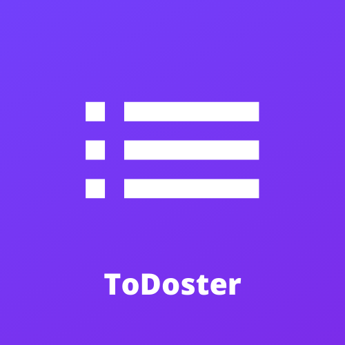
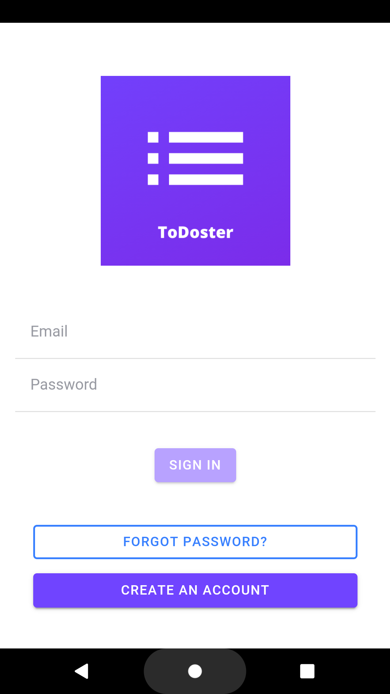
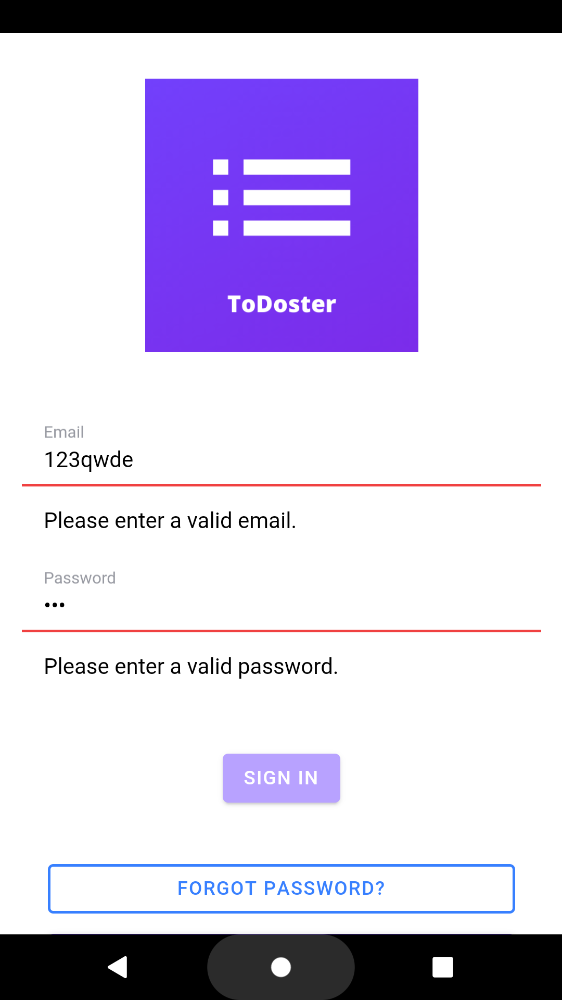
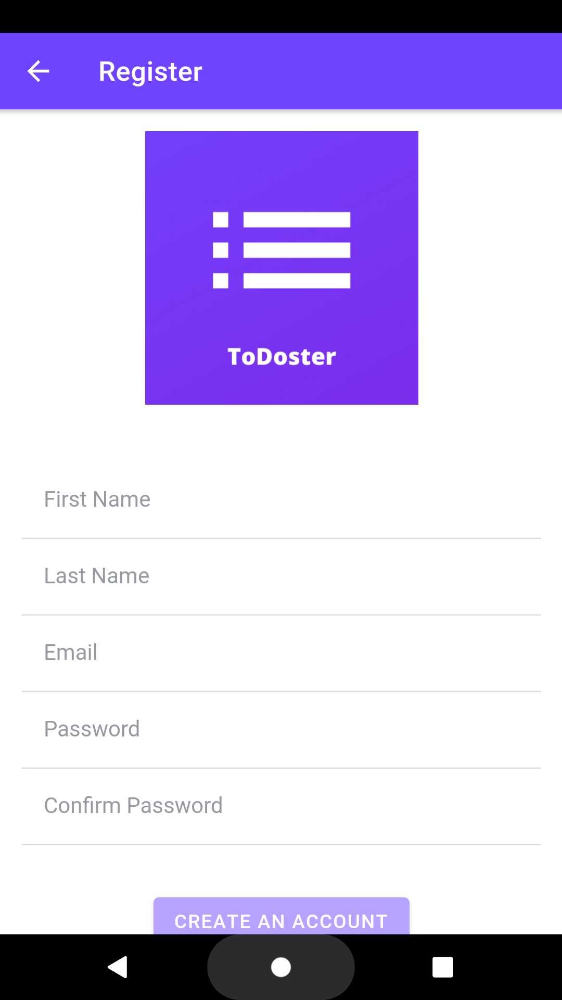
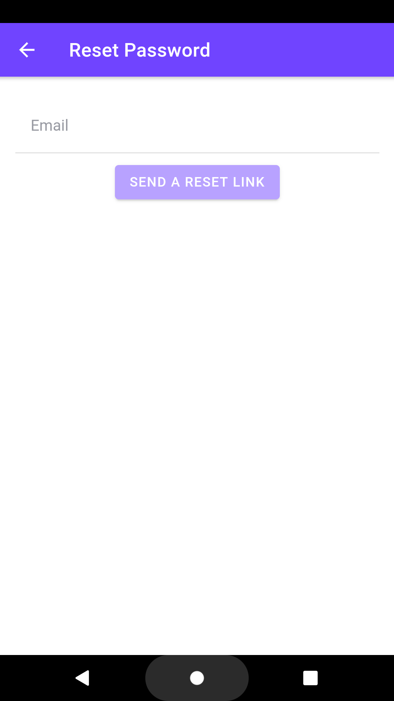
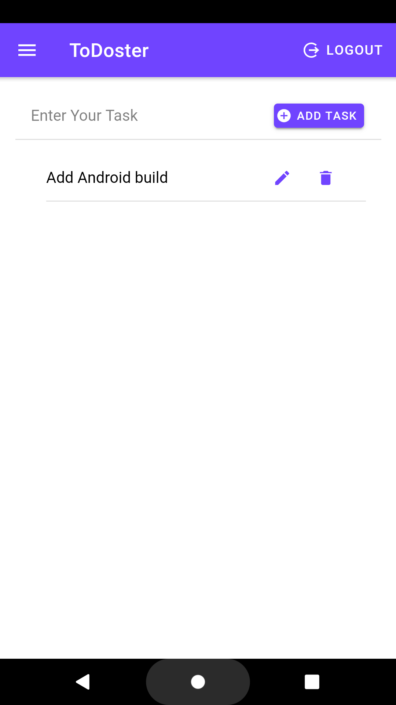
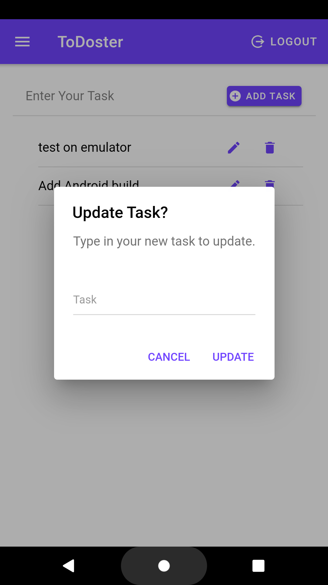
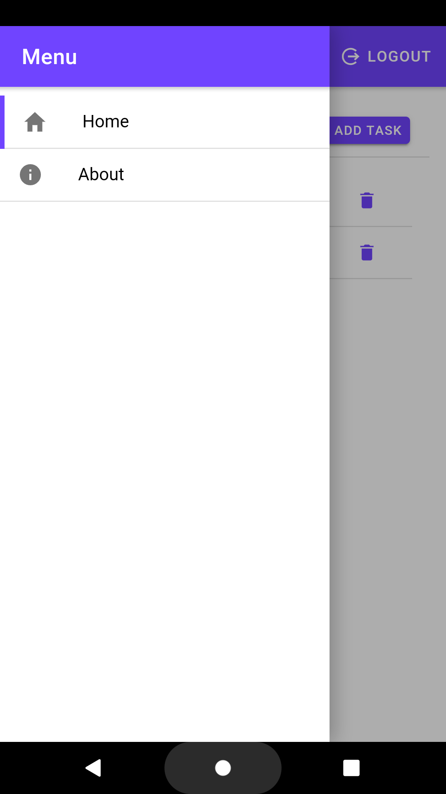
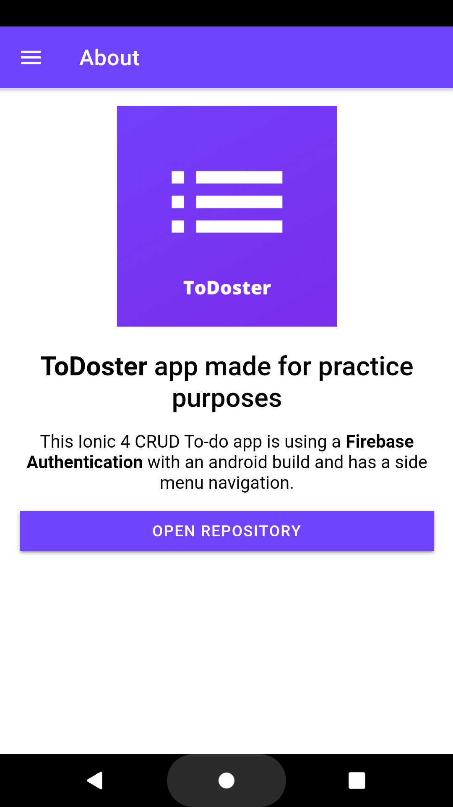

# ToDoster (ionic4-todoApp)

  

* CRUD To-do App Using **Ionic 4/Angular** with a **Firebase Authentication** (https://firebase.google.com/) and a side-menu navigation. 
* Ready to be used on Android and iOS. :tada: :sparkles: :balloon:

# Installation
1. **To use in the browser:**
* Simply clone the project and run it in your browser with an **ionic serve** command.
* https://ionicframework.com/docs/building/running
2. **To run on Android:**
* https://ionicframework.com/docs/building/android (Android build is added, only need to run it)

3. **To run on iOS:**
* If you want to run it on IOS here is a documentation: https://ionicframework.com/docs/building/ios

# Preview the ToDoster

  

# Screenshots

  
  
  
  
  
  
  
  

# Thank you for checking my app! :v:
* Hope this repository will be helpfull, happy coding or using! :grin:
